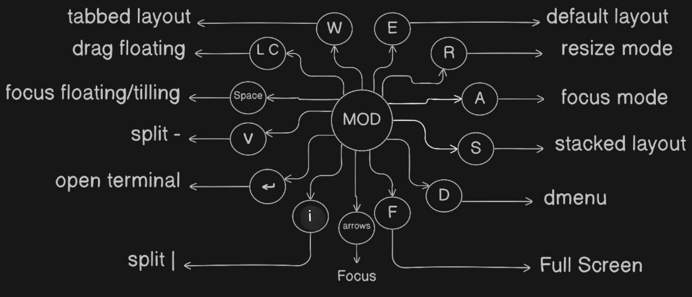
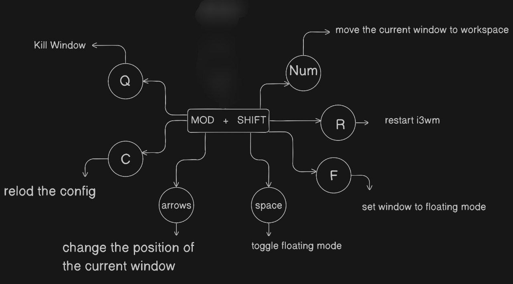

# My Linux System Configuration
<p align="center">
  
  <br>
  
  
</p>

## Table of Contents
1. [About](#about-this-setup)
2. [Features](#key-features)
3. [Installation Steps](#installation-steps)
4. [Packages Installed](#packages-installed)
 4.1  [Core Utilities](#core-utilities)
 4.2 [Gaming & Drivers](#gaming--drivers)  
 4.3 [Installed Localy (Not Included)](#install-manually-not-included)
5. [Zsh Configuration](#zsh-aliases)
6. [Keybindings](#key-bindings)
6.1 [MOD +](#mod-)
6.2 [MOD + SHIFT +](#mod--shift-)
6.3 [Custom Bindings](#custom-bindings)  
7. [Useful Tools](#useful-tools-to-be-considered-not-included)


##  About This Setup

My personalized Linux environment optimized for development, gaming, and productivity. This repository contains everything needed to recreate my Debian Linux setup:

- **Automated installation script** - Sets up the entire system with one command
- **Keyboard-centric workflow** - i3 window manager with efficient key bindings
- **Productivity enhancements** - Custom ZSH configuration and useful aliases
- **Gaming-ready environment** - NVIDIA drivers, Steam, and compatibility tools
- **Unified configuration** - Dotfiles for all core applications

> **Designed for any Debian-based distribution**


##  Key Features

- **One-Command Setup**: `./main.sh` installs everything automatically
- **Minimal i3 WM**: Fast, keyboard-driven workflow with custom keybindings
- **Productivity Boosters**: Clipboard manager, screen recorder, notification system
- **Hardware Optimized**: NVIDIA driver support and power management
- **Gaming Ready**: Steam, Wine, and gaming utilities pre-configured
- **Unified Configuration**: Dotfiles for i3, i3status, Neofetch, and more
- **Zsh config**:  pre configured zsh aliases for more productivity
- **Auto Detect MIC** :  A script that automatically detects the active recording microphone and sends a notification via Dunst.  


##  Installation Steps

```
git clone https://github.com/mena-dev-0/dotfiles
```

```
cd dotfiles
```

```
chmod +x main.sh
```

```
./main.sh
```

---

##  Packages Installed

#### Core Utilities

| Package                  | Description                                    |
|--------------------------|------------------------------------------------|
| `acpi`                   | Check CPU temperature and battery info          |
| `bleachbit`              | GUI System cleaner                  |
| `brave`					| Browser 								|
| `chatgpt-desktop-client` | ChatGPT desktop app                 |
| `com.rtosta.zapzap`      | WhatsApp desktop client (via Flatpak)          |
| `com.usebottles.bottles` | Run Windows software using Wine (GUI manager)  |
| `deepseek-desktop`       | DeepSeek desktop app                            |
| `diodon`                 | Clipboard manager                              |
| `dunst`                  | Lightweight notification daemon                |
| `ffmpeg`                 | Multimedia framework for audio/video tasks     |
| `git`                    | Version control system                         |
| `gparted`                | GUI partition editor                           |
| `grub-customizer`        | GUI tool to configure GRUB bootloader          |
| `htop`                   | Process viewer                     |
| `lightdm`                | Display manager                          |
| `maim`                   | Screenshot tool                                |
| `mousepad`               | Simple graphical text editor                   |
| `neofetch`               | Display system info in terminal                    |
| `nitrogen`               | Wallpaper manager                              |
| `nnn`                    | Terminal-based file manager                    |
| `obs`                    | Screen recording and Streaming                 |
| `okular`                 | Document viewer                        |
| `pandoc`                 | Convert between documents formats locally         |
| `picom`                  | Compositor for transparency and shadows        |
| `power-profiles-daemon`  | Power management utility                       |
| `redshift-gtk`           | Blue light filter for eye comfort              |
| `ristretto`              | Lightweight image viewer                       |
| `stacer`                 | GUI System optimizer and cleaner               |
| `virtualbox`             | Virtual machine platform                       |
| `vlc`                    | Media player                                   |
| `vnstat`                 | Track network usage over time                  |
| `xsel`                   | Clipboard manager (CLI)                        |
| `yt-dlp`                 | YouTube video downloader (CLI)                 |


#### Gaming & Drivers

| Package     | Description                             |
|-------------|-----------------------------------------|
| `steam`     | Gaming platform and launcher            |
| `nvidia`    | nvidia drivers                          |
| `gamescope` | Game-mode micro-compositor              |
| `goverlay`  |  Graphical UI to help manage Vulkan / OpenGL overlays |

####  Install Manually [Not Included]

| Package               | Description                                           |
|------------------------|-------------------------------------------------------|
| `anytype`              | note-taking app            |
| `cisco packet tracer`  | Cisco network simulator  |
| `code`                 | Visual Studio Code               |
| `freedownloadmanager`  | Download manager                      |
| `heroic`               | Game launcher (open source)    |
| `libreoffice`          | Full-featured office suite                            |
| `telegram`             | Messaging app                     |
| `zoom`                 | Meeting app                           |


## Zsh aliases
A set of useful Zsh aliases for common tasks:

- conf3 = Edit the i3 configuration file
> nano /home/$USER/.config/i3/config

- ytplay = Download an entire YouTube playlist with English subtitles and description
> yt-dlp -f \"bestvideo[height<=720]+bestaudio/best[height<=720]\" --write-subs --sub-lang en --write-auto-sub --write-description --convert-subs srt --embed-subs --merge-output-format mp4 -o \"%(playlist_title)s/%(playlist_index)s - %(title)s.%(ext)s\"

- convmd = Convert files into pdf using WeasyPrint (using it for markdown files)
> pandoc --pdf-engine weasyprint

- clip = Copy text to the system clipboard
> xsel --clipboard
- cheat = to get simple details about any command
> cheat() {curl "cheat.sh/$*"}


## Key Bindings

### 1.  MOD +

 
 

> Setting $MOD = Windows key
### 2.  MOD + SHIFT +



> Setting $MOD = Windows key
> 
### 3. Custom Bindings
> Setting $MOD = Windows key
####   Applications
- `MOD + CTRL + Z` → Open File Manager  
- `MOD + CTRL + C` → Launch Brave  
- `MOD + CTRL + V` → Open VS Code  
- `MOD + CTRL + M` → Open Mousepad  
- `MOD + CTRL + A` → Launch AnyType  
- `MOD + CTRL + G` → Launch ChatGPT  
- `MOD + CTRL + W` → Open WhatsApp  
- `MOD + CTRL + T` → Open Telegram  

#### Screenshots
- `Print` → Screenshot the entire frame  
- `MOD + Print` → Select area to screenshot  

#### Gaps Management
- `MOD + CTRL + ↑` → Increase inner gaps by 5  
- `MOD + CTRL + ↓` → Decrease inner gaps by 5  
- `MOD + CTRL + ←` → Increase outer gaps by 5  
- `MOD + CTRL + →` → Decrease outer gaps by 5  

#### Volume Control
- `MOD + CTRL + =` → Increase volume by 5%  
- `MOD + CTRL + -` → Decrease volume by 5%  

#### Brightness Control
- `MOD + CTRL + ]` → Increase brightness by 5%  
- `MOD + CTRL + [` → Decrease brightness by 5%  

#### Other
- `ALTs` → Switch language (EN , AR)
- `MOD + CTRL + Q` → Power Menu


## Useful tools to be considered [Not included]

- alacarte 
> menu editor 
- lxappearance
> theme switcher
- Time shift
> gui snapshot management tool  
