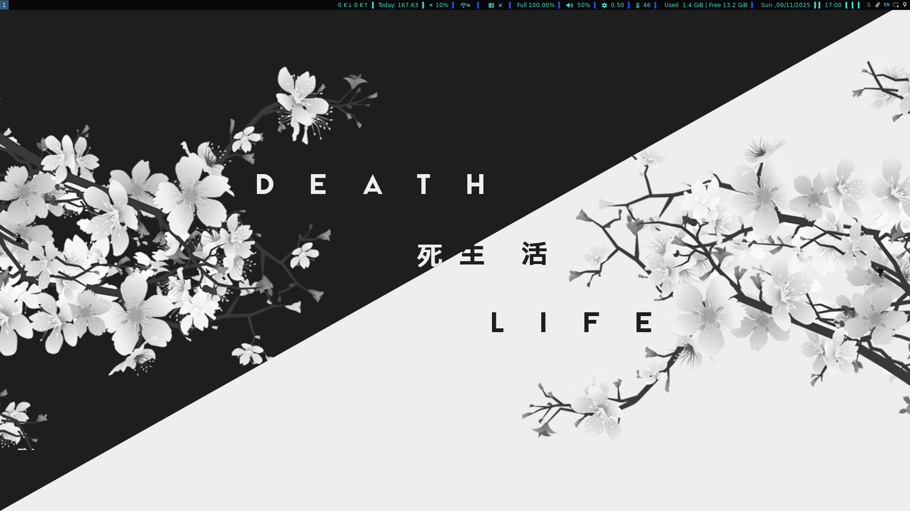
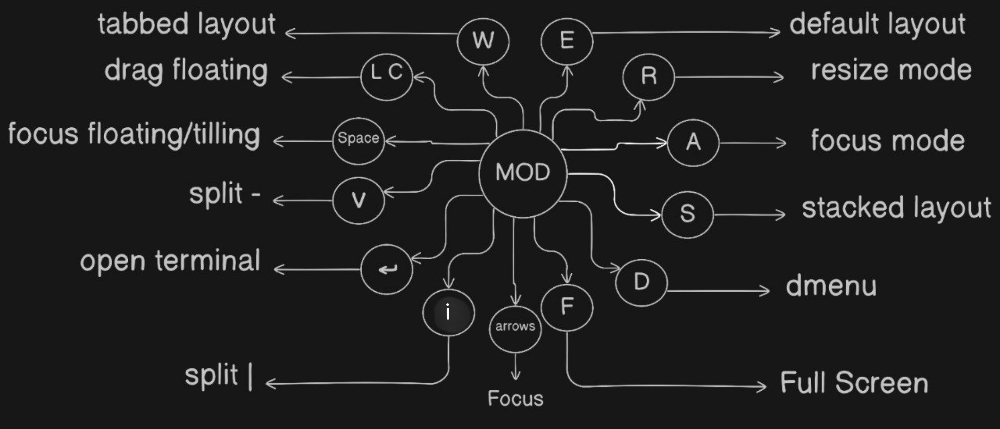
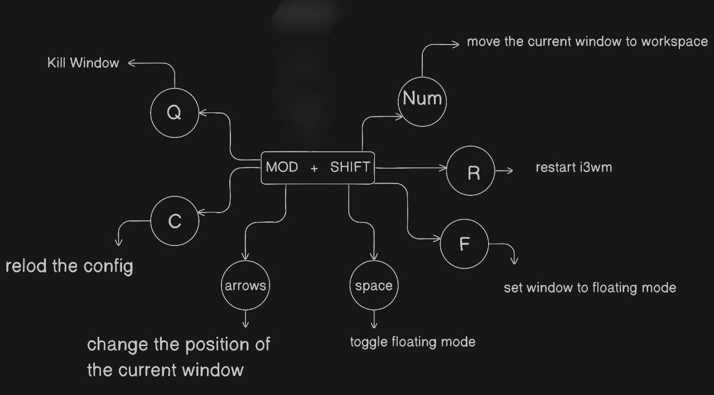

# My Linux System Configuration
<p align="center">
  
  <br>
  
  
  
</p>


## Table of Contents
1. [About](#about-this-setup)
2. [Features](#key-features)
3. [Installation Steps](#installation-steps)
4. [Packages Installed](#packages-installed)
   - [Core Utilities](#core-utilities)
   - [Installed Localy (Not Included)](#install-manually-not-included)
5. [Zsh Configuration](#zsh-aliases)
6. [Key Bindings](#key-bindings)
   - [MOD +](#1-mod--)
   - [MOD + SHIFT +](#2-mod--shift-)
   - [Custom Bindings](#custom-bindings)
7. [Bar Content](#bar-content)
8. [Useful Tools](#useful-tools-to-be-considered-not-included)

## About This Setup




## **IMPORTANT:** Do **NOT** run the script as root. Run it as normal user.

My personalized Linux environment optimized for development, gaming, and productivity. Designed for any Debian-based distribution, this repository contains everything needed to recreate my exact setup with a single command.

###  Key Features

- **One-Command Setup:** Fully automated installation script that handles system updates, dependencies, and configurations.
- **Minimal i3 WM**: Fast, keyboard-driven workflow with custom keybindings
- **Zsh config**:  pre configured zsh aliases for more productivity
- **Hardware & Gaming Ready:** Out-of-the-box support for NVIDIA drivers and power management, alongside a pre-configured environment for Steam, Wine, and gaming utilities.
- **Unified configuration** - Dotfiles for all core applications
- **Auto Detect MIC** : A script that automatically detects the active recording microphone and sends a notification via Dunst.

##  Installation Steps

```
git clone https://github.com/mena-dev-0/dotfiles
```

```
cd dotfiles
```

```
chmod +x main.sh
```

```
./main.sh
```

---

##  Packages Installed

#### Core Utilities

| Package | Description |
|---|---|
| `acpi` | Check CPU temperature and battery info |
| `android-sdk-platform-tools` | Tools for interacting with Android devices (adb, fastboot) |
| `atril` | Lightweight document and PDF viewer|
| `bleachbit` | Disk space cleaner |
| `blueman` | Graphical Bluetooth manager and configuration tool |
| `bridge-utils` | Utilities for configuring the Linux Ethernet bridge (for VMs) |
| `brightnessctl` | Utility to read and control device display brightness |
| `build-essential` | Essential compilation tools (gcc, make, libc) for building software |
| `curl` | Command-line tool for transferring data over network protocols  |
| `diodon` | Lightweight GTK+ clipboard manager |
| `fastfetch`| Display System info|
| `ffmpeg` | Powerful multimedia framework to decode, encode, and transcode audio/video |
| `file-roller` | Archive manager (extract and create zip, tar, rar files) |
| `fonts-font-awesome` | Iconic font and CSS toolkit for rendering symbols |
| `fonts-lmodern` | Latin Modern fonts  |
| `fonts-noto-color-emoji` | Google's Noto Color Emoji font for displaying emojis correctly |
| `g++` | The GNU C++ compiler |
| `gdb` | The GNU Debugger for C/C++ programming |
| `gparted` | Graphical partition editor for managing disk drives |
| `grub-customizer` | Graphical interface to configure bootloader settings |
| `gvfs` | Userspace virtual filesystem (needed for mounting external drives smoothly) |
| `gvfs-backends` | Backends for gvfs  |
| `gvfs-fuse` | Allows FUSE mounts for the gvfs system |
| `htop` | Process viewer and system monitor |
| `i3` | Tiling window manager for X11 |
| `imagemagick` | Image manipulation and conversion |
| `kitty` | Terminal emulator |
| `libmtp-runtime` | Media Transfer Protocol (MTP) runtime files (for mobile devices) |
| `libnotify-bin` | Utility to send desktop notifications from the command line |
| `libqt5x11extras5-dev` | Qt 5 X11 extras development files |
| `libvirt-clients` | Client binaries for interacting with libvirt  |
| `libvirt-daemon-system` | Libvirt daemon system files (backend for virtualization) |
| `lightdm` | Display manager|
| `lxappearance` | Desktop-independent GTK+ theme switcher |
| `maim` | Command-line utility to take screenshots  |
| `mousepad` | Text editor  |
| `mtp-tools` | Media Transfer Protocol tools for communicating with Android/MTP devices |
| `nethogs` | Terminal-based network top tool grouping bandwidth per process |
| `network-manager` | Network management daemon  |
| `network-manager-gnome` | Graphical systray icon for NetworkManager |
| `nitrogen` | Background browser and wallpaper setter for X11 |
| `nnn` | Terminal-based file manager |
| `numlockx` | Utility to automatically enable NumLock in X11 sessions |
| `obs-studio` | Video recording and live streaming |
| `pandoc` | Universal document converter  |
| `picom` | Lightweight compositor for X11  |
| `pkg-config` | Helper tool used when compiling applications and libraries |
| `power-profiles-daemon` | Daemon for managing power profiles (power saver, balanced, performance) |
| `pulseaudio-module-bluetooth` | Bluetooth module for PulseAudio sound server |
| `python3` | Python language |
| `python3-pip` | Package installer for Python 3 |
| `python3-venv` | Module for creating virtual environments in Python |
| `qemu-guest-agent` | Guest-side agent for QEMU virtual machines |
| `qemu-kvm` | Full virtualization solution on x86 hardware |
| `qt5-qmake` | Qt 5 Makefile generator tool |
| `qtbase5-dev` | Qt 5 base development files |
| `redshift` | Blue-light filter for the screen |
| `redshift-gtk` | GTK+ integration and systray icon for Redshift |
| `ristretto` | Image viewer |
| `thunar` | GUI file manager |
| `v4l2loopback-dkms` | Kernel module to create virtual video devices (useful for OBS virtual camera) |
| `virt-manager` | Graphical desktop user interface for managing virtual machines |
| `virtiofsd` | Shared file system daemon for virtual machines |
| `vlc` | GUI Video Player |
| `wireplumber` | Session and policy manager for PipeWire  |
| `x11-xserver-utils` | X server utilities  |
| `xinit` | X Window System initializer |
| `xorg` | The public, open-source implementation of the X Window System |
| `xsel` | Command-line utility for interacting with the X11 clipboard |
| `xserver-xorg` | The core X11 display server |
| `yt-dlp` | Command-line audio/video downloader (fork of youtube-dl) |
| `zsh` | The Z shell|
| `zsh-autosuggestions` | autosuggestions plugin for Zsh |


####  Install Manually [Not Included]

| Package                | Description                |
|------------------------|----------------------------|
| `anytype`              | note-taking app            |
| `cisco packet tracer`  | Cisco network simulator    |
| `code`                 | Visual Studio Code         |
| `freedownloadmanager`  | Download manager           |
| `gamescope` | Game-mode micro-compositor              |
| `goverlay`  |  Graphical UI to help manage Vulkan / OpenGL overlays |
| `heroic`               | Game launcher (open source)|
| `libreoffice`          | Full-featured office suite |
| `steam`     | Gaming platform and launcher            |
| `telegram`             | Messaging app              |
| `zoom`                 | Meeting app                |


## Zsh aliases
A set of useful Zsh aliases for common tasks:

- conf3 = Edit the i3 configuration file
> nano /home/$USER/.config/i3/config

- ytplay = Download an entire YouTube playlist with English subtitles and description
> yt-dlp -f \"bestvideo[height<=720]+bestaudio/best[height<=720]\" --write-subs --sub-lang en --write-auto-sub --write-description --convert-subs srt --embed-subs --merge-output-format mp4 -o \"%(playlist_title)s/%(playlist_index)s - %(title)s.%(ext)s\"

- convmd = Convert files into pdf using WeasyPrint (using it for markdown files)
> pandoc --pdf-engine weasyprint

- clip = Copy text to the system clipboard
> xsel --clipboard
- cheat = to get simple details about any command
> cheat() {curl "cheat.sh/$*"}


## Key Bindings

### 1.  MOD +

 
 

> Setting $MOD = Windows key
### 2.  MOD + SHIFT +



> Setting $MOD = Windows key
> 
### 3. Custom Bindings
> Setting $MOD = Windows key
####   Applications
- `MOD + CTRL + Z` → Open File Manager  
- `MOD + CTRL + C` → Launch Brave  
- `MOD + CTRL + V` → Open VS Code  
- `MOD + CTRL + M` → Open Mousepad  
- `MOD + CTRL + A` → Launch AnyType  
- `MOD + CTRL + G` → Launch ChatGPT  
- `MOD + CTRL + W` → Open WhatsApp  
- `MOD + CTRL + T` → Open Telegram  

#### Screenshots
- `Print` → Screenshot the entire frame  
- `MOD + Print` → Select area to screenshot  

#### Gaps Management
- `MOD + CTRL + ↑` → Increase inner gaps by 5  
- `MOD + CTRL + ↓` → Decrease inner gaps by 5  
- `MOD + CTRL + ←` → Increase outer gaps by 5  
- `MOD + CTRL + →` → Decrease outer gaps by 5  

#### Volume Control
- `MOD + CTRL + =` → Increase volume by 5%  
- `MOD + CTRL + -` → Decrease volume by 5%  

#### Brightness Control
- `MOD + CTRL + ]` → Increase brightness by 5%  
- `MOD + CTRL + [` → Decrease brightness by 5%  

#### Other
- `ALTs` → Switch language (EN , AR)
- `MOD + CTRL + Q` → Power Menu


## Bar Content


1. Apps tray
2. Time 
3. Date
4. Memory usage
5. Cpu temperature
6. Cpu core clock
7. Volume
8. Battery Percentage
9. Lan IP
10. Wan IP
11. Brightness Level
12. Total Download Traffic per day
13. Traffic Meter
14. Workspaces

## Useful tools to be considered [Not included]

- alacarte 
> menu editor 
- Time shift
> gui snapshot management tool  
- Qute Browser
> web browser with vim-style key bindings and a minimal graphical user interface.
- Bottles 
> for Windows apps. Install it via " flatpak install --noninteractive flathub com.usebottles.bottles"
